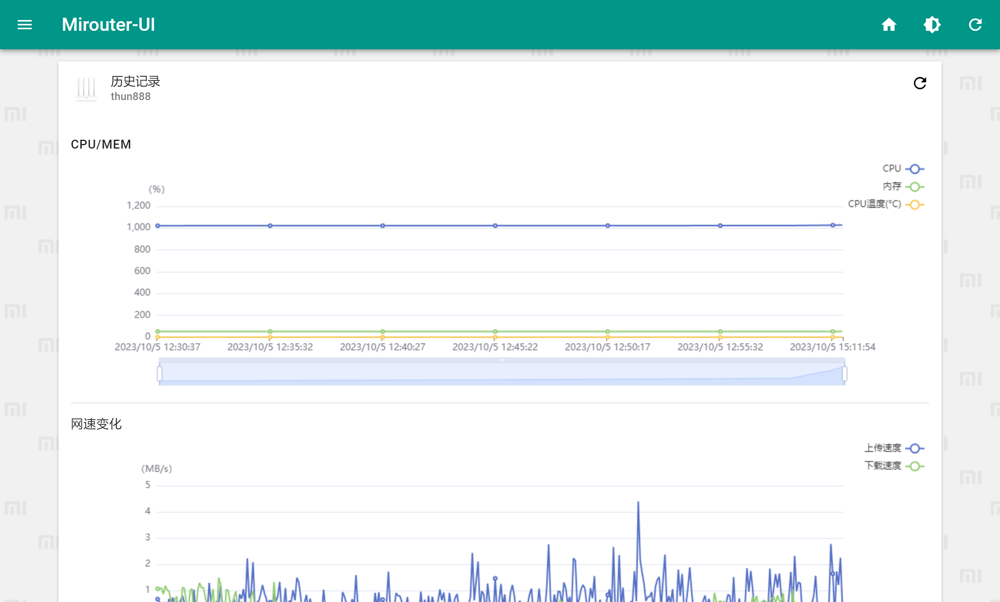
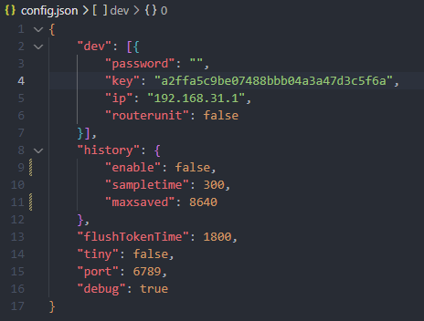

## Mirouter-ui

> 😎 基于小米路由器API的展示面板

将本程序部署在小米路由器的网络环境中，配置完成即可食用

后端基于`Golang`，多平台兼容

已在小米路由器R1D,R4A上测试通过

部分新路由无法获取cpu占用，如红米AX6000,AX1800。可在路由器上运行解决。

## 图片展示

#### 首页

#### 设备列表

#### 设备详情

#### 路由器状态

#### 温度显示（仅支持部分设备）

#### 历史数据统计

## 部署

### Docker

> docker run -d -p 6789:6789 -v $(pwd):/app/data --name mirouter-ui --restart=always thun888/mirouter-ui

新建一个文件夹，并在该文件夹里运行上述命令，程序会在该文件夹里生成配置文件，修改即可

### 直接运行

#### 下载

从[Release](https://github.com/thun888/mirouter-ui/releases/)下载二进制文件

> 可访问[镜像站](https://mrui-api.hzchu.top/down/)以获取更快的速度

如果路由器有足够（内存）空间可以下载对应架构版本的部署在路由器上（ps:使用`uname -m`查看，若为armv7l,请使用armv5版本）

#### 获取key

> 自动获取：[Mirouterui/MiKVIVator](https://github.com/Mirouterui/MiKVIVator)
> ps:我在3个路由器上发现了一样的数值，已添加为默认值，如果无法登录再尝试更改吧

打开路由器登录页面，右键，点击`查看页面源代码`，按下`CTRL + F`组合键打开搜索框，搜索`key:`，不出意外你能看见以下结果

复制双引号里的内容粘贴到`config.json`对应栏目中，并填上密码（路由器后台密码）

> config.json 会在初次运行时自动下载
> ip可以根据实际情况修改

**配置项**：

| 配置名 | 默认值 | 解释                                                         |
| ------ | ------ | ------------------------------------------------------------ |
| dev    | []     | 路由器信息，参阅`dev项`                                      |
| history    |      | 历史记录相关功能，参阅`history项`                                      |
| tiny   | false  | 启用后，不再下载静态文件，需搭配[在线前端](http://mrui.hzchu.top:8880/)使用 |
| flushTokenTime | 1800 | 刷新token时间间隔(s) |
| port   | 6789   | 网页页面端口号                                               |
| debug  | true   | debug模式，建议在测试正常后关闭                              |

**dev**项：

| 配置名     | 默认值                           | 解释                                    |
| ---------- | -------------------------------- | --------------------------------------- |
| password   |                                  | 路由器管理后台密码                      |
| key        | a2ffa5c9be07488bbb04a3a47d3c5f6a | 路由器管理后台key                       |
| ip         | 192.168.31.1                     | 路由器IP                                |
| routerunit | false                            | 启用后，程序通过`gopsutil`库获取CPU占用 |

**history**项：

| 配置名     | 默认值                           | 解释                                    |
| ---------- | -------------------------------- | --------------------------------------- |
| enable   |    false                              | 是否启用历史数据统计                      |
| sampletime        | 300 | 采样时间间隔(s)                    |
| maxsaved         | 8640                     | 最多记录条数                                |

命令行参数：

| 参数            | 解释                             |
| --------------- | -------------------------------- |
| --config        | 配置文件路径，默认为“./config.json”  |
| --basedirectory | 基础目录路径，在里面存放静态文件 |
| --databasepath | 数据库路径，默认为“./database.db” |

然后运行程序

如果遇到防火墙提示请勾上两个勾并确定

此时命令窗口中会显示网页的访问端口，使用设备的`ip地址+端口号(6789)`访问面板

### 后台运行

自行参考：

[Linux命令后台运行_后台运行命令_拉普拉斯妖1228的博客-CSDN博客](https://blog.csdn.net/caesar1228/article/details/118853871)

[windows守护进程工具--nssm详解 - 与f - 博客园 (cnblogs.com)](https://www.cnblogs.com/fps2tao/p/16433588.html)

### Todo

- [x] 历史数据统计
- [x] 深色模式
- [x] 多路由支持
- [x] 快捷更新
- [ ] 设备小工具

> 主要功能已完成开发,接下来随缘更新😶‍🌫️

## Stars~

